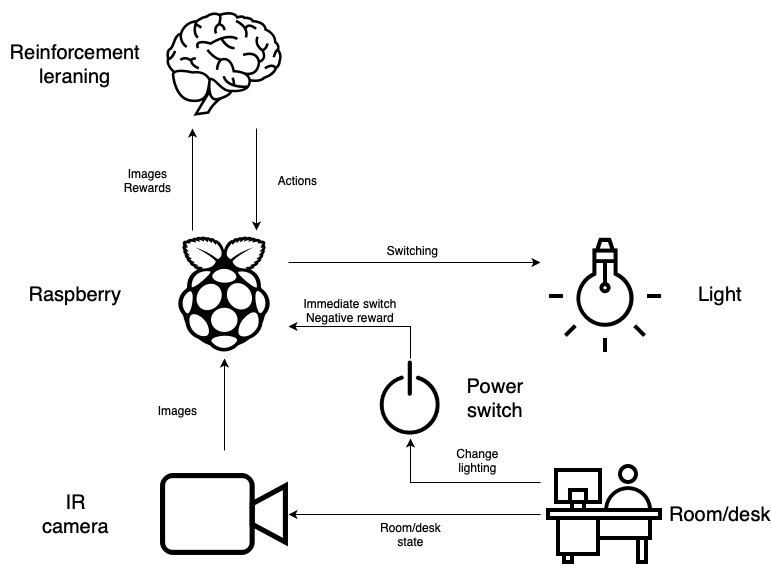

# RLight
RLight is a home lighting automation system solely based on cameras using deep reinforcement learning.

## Specification

- The room contains one source of light and one soft switch
- By pushing the switch the user can indirectly turn on or off the lighting
- The IR camera records pictures about the room to capture its state
- The IR camera can record images even in a dark settings, so it can turn on the lighting if necessary
- The pictures are low resolution to capture only the room layout thus protecting privacy
- The pictures are taken every second, so that the system has a one second response time to changes in the room
- The images and switch inputs are collected by the Raspberry PI (RPI)
- The state of the light is controlled by the RPI
- Upon switching the RPI instantly switches the state of the light
- On the RPI a Reinforcement Learning (RL) agent is running
- The role of the agent is to automate lighting so, that the user never has to intervene with the switch
- The other role of the agent is to minimize power consumption by not turning on the light when not necessary
- The switching inputs are converted to negative rewards for the agent
- The power consumption of the light (the time it is on) is converted to negative rewards for the agent
- The RL agent receives images and rewards and sends back switching commands
- Since the agent only receives negative rewards maximizing those means converging to zero rewards
- If the agent maximizez reward both the user interventions and power consumption is minimal

## Tasks

- Create container for webcam capturing
- Gather small resolution images using a webcam
- Determine ideal reward amounts for elecrticity usage and user intervention
- Create container for TensorFlow
- Build an image stream processing neural network (possibly convolutional and LSTM layers)
- Create container for RL
- Build a RL agent
- Connect together the subsystems
- Create Docker compose for the system
- Install smart light in room
- Control smart light with Phillips Hue Python API
- Train network

## Notes

- If the agent fails to control the lights correctly, it is a 15 second interruption for the user. The value of that lost time is determined by the users hourly rate. For example this time is worth 4.17 cents at a 10 dollar an hour rate.
- When the agent turns on the light it is consuming electricity. The cost of that is easily calculated using the cost of electricity. Lets take an example of a 20W LED light bulb. Each second the light is on the consumpption is 5,6 * 10^(-6) kWh, which is 5,6 * 10^(-5) cents at a 0.1 dollar per kWh electricity cost.
